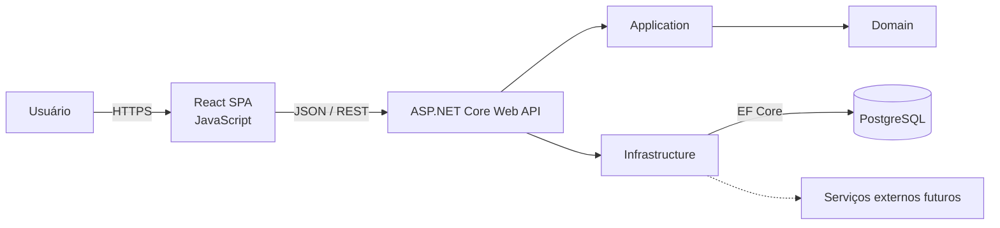
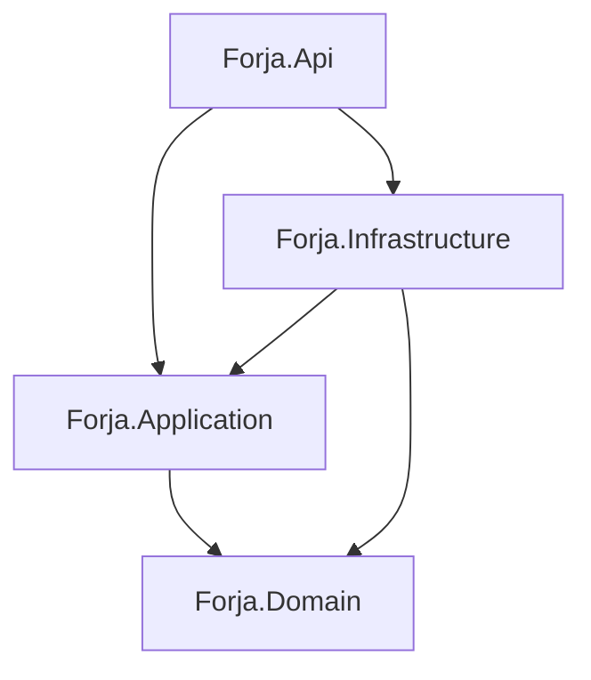

# Arquitetura de referência

## 1. Status e objetivo

Este documento orienta a reconstrução do Forja Jiu-Jitsu. Ele substitui a arquitetura do protótipo Next.js/TypeScript/Supabase e define limites claros para uma solução com backend C# e frontend React em JavaScript.

Decisão inicial: adotar um **monólito modular**. O sistema permanece simples de executar e implantar, enquanto os módulos e dependências internas evitam que regras de negócio se espalhem pela API, pelo banco ou pelo frontend.

## 2. Visão de contêineres



- **React SPA:** experiência de usuário, rotas, formulários e estado de interface.
- **ASP.NET Core Web API:** autenticação, autorização, contratos HTTP e composição da aplicação.
- **Application:** casos de uso, validação de fluxo, transações e interfaces de dependências.
- **Domain:** entidades, regras, valores e eventos de domínio, sem dependência de banco ou web.
- **Infrastructure:** Entity Framework Core, identidade, repositórios, arquivos e integrações externas.
- **PostgreSQL:** persistência transacional. Não é acessado diretamente pelo frontend.

## 3. Organização do repositório

```text
backend/
├── src/
│   ├── Forja.Api/
│   ├── Forja.Application/
│   ├── Forja.Domain/
│   └── Forja.Infrastructure/
└── tests/
    ├── Forja.UnitTests/
    └── Forja.IntegrationTests/

frontend/
├── public/
├── src/
│   ├── app/
│   ├── assets/
│   ├── components/
│   ├── features/
│   ├── lib/
│   ├── pages/
│   └── styles/
└── tests/
```

As pastas do frontend devem ser orientadas por funcionalidade. Componentes específicos ficam em `features/<modulo>`; somente componentes realmente reutilizáveis vão para `components`.

## 4. Regra de dependências do backend



- `Domain` não referencia nenhum outro projeto da solução.
- `Application` conhece o domínio e declara portas/interfaces necessárias.
- `Infrastructure` implementa essas portas.
- `Api` configura injeção de dependência e traduz HTTP para casos de uso.
- Controllers ou endpoints não contêm regra de negócio nem acessam o `DbContext` diretamente.

## 5. Módulos funcionais

| Módulo | Responsabilidade |
| --- | --- |
| Identity & Access | autenticação, usuários, papéis e recuperação de acesso |
| Academies | academias, slug, estado e configuração do tenant |
| Teams | turmas e vínculos de professores |
| Students | solicitação, aprovação, perfil e graduação |
| Billing | mensalidades, baixas manuais e histórico |
| Tournaments | eventos, categorias, inscrições, chaves e lutas |
| Reporting | consultas e indicadores sem comandar mudanças de domínio |
| Audit | registro de ações sensíveis |

Os módulos compartilham o mesmo processo e banco no início, mas não devem alterar tabelas uns dos outros por atalhos. A comunicação ocorre por casos de uso e contratos internos explícitos.

## 6. Multi-tenancy e autorização

`AcademyId` é a chave de isolamento. O tenant é obtido do usuário autenticado e de seus vínculos; um identificador enviado pelo navegador nunca é suficiente para conceder acesso.

Fluxo recomendado:

1. O slug resolve a academia somente em rotas públicas permitidas, como identificação e cadastro.
2. Após autenticação, claims mínimas identificam o usuário; vínculos e permissões são validados no backend.
3. Casos de uso recebem um `TenantContext` confiável.
4. Consultas aplicam filtro por `AcademyId`; comandos verificam também o vínculo exigido.
5. Testes de integração tentam acesso cruzado entre tenants.

Filtros globais do EF Core podem atuar como defesa adicional, mas não substituem políticas de autorização e testes. O Super Admin deve usar políticas explícitas para operações globais.

## 7. Autenticação

A implementação do provedor de identidade ainda é uma decisão pendente. Independentemente da escolha:

- a API valida a identidade e emite ou aceita credenciais de curta duração;
- senhas não são gerenciadas pelo frontend nem armazenadas em tabelas de domínio;
- autorização usa políticas por capacidade e vínculo, não apenas verificações de texto do papel;
- refresh tokens, se utilizados, precisam de rotação e revogação;
- endpoints administrativos devem possuir proteção e auditoria adicionais.

## 8. API

- Base sugerida: `/api/v1`.
- Recursos no plural, JSON e nomes consistentes.
- Códigos HTTP representam o resultado; erros seguem um formato único, preferencialmente Problem Details.
- Listagens possuem paginação, filtros e ordenação explícitos.
- Operações que podem ser repetidas por falha de rede devem considerar idempotência.
- O contrato deve ser publicado em OpenAPI e validado nos testes.

Exemplos de grupos de rotas:

```text
/api/v1/auth/*
/api/v1/academies/*
/api/v1/teams/*
/api/v1/students/*
/api/v1/monthly-fees/*
/api/v1/tournaments/*
```

Não se deve modelar a API como espelho direto das tabelas. Cada endpoint representa uma consulta ou ação permitida do produto, como `POST /students/{id}/approve`.

## 9. Persistência

- PostgreSQL é o banco relacional principal.
- Entity Framework Core gerencia mapeamentos e migrations versionadas.
- UUID é o padrão de identificador público.
- Valores monetários usam `decimal` com precisão definida; nunca `float`.
- Instantes são persistidos em UTC. Competências mensais e datas civis não devem ganhar fuso artificial.
- Índices devem cobrir `AcademyId`, chaves estrangeiras e filtros operacionais frequentes.
- Restrições únicas protegem invariantes, como mensalidade por aluno/competência.
- Exclusão lógica e campos de auditoria são exigidos para dados com histórico.

O banco inicial pode ser único e compartilhado, com `AcademyId` nas tabelas do tenant. Separação física por tenant só deve ser considerada diante de requisito regulatório ou operacional concreto.

## 10. Frontend

O frontend é uma SPA React escrita em JavaScript, sem TypeScript. A separação mínima é:

- `app`: inicialização, roteamento e providers;
- `features`: telas, componentes e chamadas de API de cada módulo;
- `components`: design system compartilhado;
- `lib`: cliente HTTP e utilitários sem regra de negócio;
- `pages`: composição de páginas e limites de rota.

O cliente deve tratar estados de carregamento, vazio, erro e falta de permissão. Regras de interface melhoram a experiência, mas não substituem validações do backend. Tokens sensíveis não devem ficar em armazenamento inseguro acessível a scripts quando houver alternativa baseada em cookie protegido.

## 11. Testes

- **Unitários:** regras de domínio e casos de uso sem infraestrutura real.
- **Integração:** API, autenticação/autorização, EF Core e PostgreSQL compatível com produção.
- **Contrato:** OpenAPI e formatos consumidos pelo frontend.
- **Frontend:** componentes e fluxos críticos.
- **Ponta a ponta:** cadastro/aprovação, baixa de mensalidade e execução de campeonato.

Casos de isolamento entre academias e permissões negativas são obrigatórios, não opcionais.

## 12. Operação e segurança

- configuração por ambiente e segredos fora do repositório;
- logs estruturados sem senha, token ou dados pessoais desnecessários;
- identificador de correlação em cada requisição;
- health checks separados para processo e dependências;
- migrations executadas de forma controlada no deploy;
- backup e restauração testados;
- CORS restrito às origens conhecidas;
- rate limiting em autenticação e rotas públicas sensíveis;
- dependências verificadas e atualizadas regularmente.

## 13. Estratégia de implementação

Construir por fatias verticais reduz o risco de criar todas as camadas sem entregar um fluxo utilizável:

1. fundação da solução, banco, identidade e tenant;
2. academias, turmas e vínculo de professor;
3. cadastro e aprovação de aluno de ponta a ponta;
4. perfil e graduação;
5. mensalidades e baixa manual;
6. campeonatos, categorias, inscrições e chaves;
7. relatórios, auditoria e endurecimento operacional.

Cada fatia deve incluir contrato da API, regra de domínio, persistência, interface e testes relevantes.

## 14. Decisões pendentes

Antes de criar a infraestrutura definitiva, registrar ADRs para:

- versão alvo do .NET e política de atualização;
- provedor de identidade e estratégia de tokens/cookies;
- biblioteca de roteamento, dados remotos e formulários do React;
- execução local e deploy (contêineres, nuvem e CI/CD);
- armazenamento de fotos e outros arquivos;
- mecanismo de notificações futuras.

Essas escolhas não alteram os limites definidos neste documento. Mudanças nos limites ou na direção arquitetural devem ser justificadas em `docs/decisoes/`.
