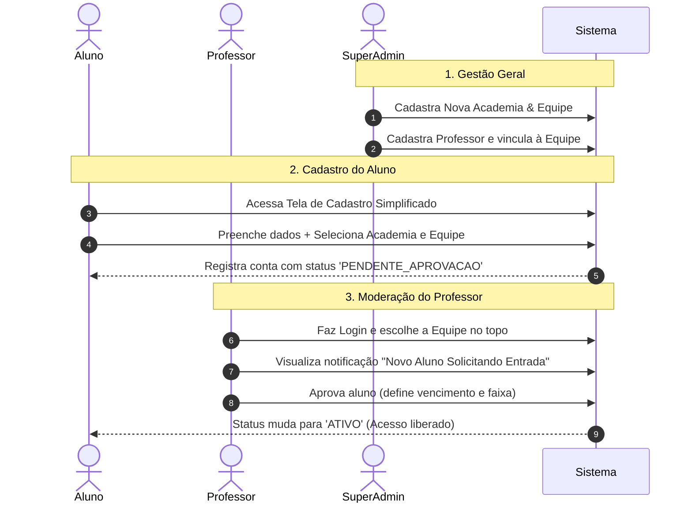
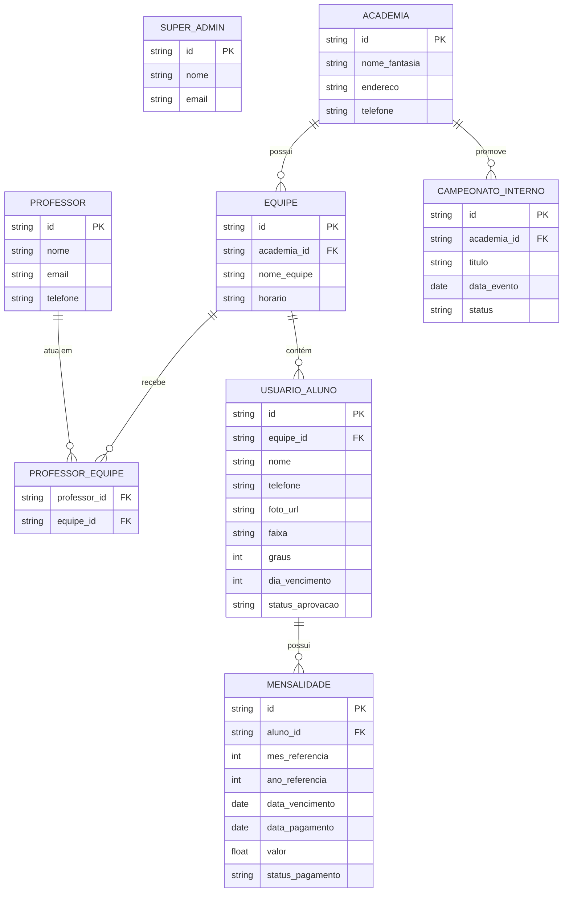

# 🥋 Documento de Contexto do Sistema — Forja Jiu-Jitsu

## 1. Visão Geral do Projeto
O **Forja Jiu-Jitsu** é uma plataforma SaaS desenvolvida para a gestão simplificada e eficiente de academias de Jiu-Jitsu. O sistema atende desde o **Super Admin (Admin Geral)** que gerencia a rede de academias, até os **Professores/Gestores de Academia** que dão aula para múltiplos times e gerenciam alunos e campeonatos internos, e os **Alunos (Atletas)**.

---

## 2. Hierarquia e Perfis de Usuários (Roles & Permissões)

### 2.1. Super Admin (Admin Geral / Gestor da Plataforma)
* Nível mais alto do sistema.
* Cadastro e gestão de **Academias** (Matrizes e Filiais).
* Cadastro e gestão de **Equipes/Times** (ex: Equipe Adulto Noite, Equipe Infantil, Equipe Competição).
* Cadastro de **Professores/Admins de Academia** e vinculação aos seus respetivos times/academias.
* Visão global de métricas da plataforma.

### 2.2. Professor / Admin de Academia (Gestor da Equipe)
* Responsável por uma ou mais equipes/times dentro de uma ou mais academias.
* **Seletor de Equipe no Topo**: Altera o contexto da plataforma para gerenciar a equipe onde está dando aula no momento (ou visão consolidada).
* **Aprovação de Alunos**: Modera e aprova/rejeita os cadastros de novos alunos que solicitaram entrada no seu time.
* Gestão de alunos cadastrados e aprovados.
* **Baixa manual de pagamentos** (marcar parcelas como "Pago" / "Pendente" / "Atrasado") estilo planilha.
* **Campeonatos Internos**: Criação e gerenciamento completo de campeonatos internos da academia exclusivamente para os alunos matriculados nas equipes.

### 2.3. Aluno (Atleta)
* **Cadastro Simplificado**: Cria a conta informando dados básicos, escolhe a sua **Academia** e a sua **Equipe/Time**.
* **Status Inicial (`Pendente de Aprovação`)**: Fica em tela de espera aguardando a liberação do seu Professor.
* **Após Aprovação**: Acesso ao perfil (carteirinha digital com foto, faixa e graus), consulta de parcelas/mensalidades e participação/acompanhamento nos campeonatos internos da sua academia.

---

## 3. Fluxo de Autenticação e Cadastro (Onboarding)

---

## 4. Módulos do Sistema e Funcionalidades

### 4.1. Módulo de Autenticação e Multi-Equipe
* **Login Único**: Tela de login padrão para todas as roles (Super Admin, Professor e Aluno). O sistema redireciona automaticamente para o painel correspondente à credencial.
* **Seletor de Equipe no Topo (Visão Professor)**: Dropdown fixo no cabeçalho permitindo ao professor alternar instantaneamente entre suas equipes (ex: "Equipe Adulto Noite", "Equipe Manhã", "Todas as Equipes"). Todo o financeiro, lista de alunos e chamada são filtrados com base nessa seleção.

### 4.2. Módulo de Gestão de Alunos e Aprovações
* **Fila de Aprovação**: Aba exclusiva onde o professor vê solicitações de novos alunos pendentes, podendo conferir a foto/dados e aprovar com 1 clique.
* **Perfil do Aluno**: Nome, Telefone/WhatsApp, Foto de perfil, Faixa atual, Quantidade de Graus (0 a 4), Histórico de graduação, e Dia de Vencimento fixo.

### 4.3. Módulo Financeiro (Controle Manual / Planilha Inteligente)
> **Premissa fundamental**: Sem gateway de pagamento. Pagamento presencial (PIX direto, Dinheiro, Maquineta) com baixa manual pelo Professor.

* **Visão em Grade / Planilha**: Tabela filtrada por equipe contendo alunos x meses.
* **Badges Visuais**: 🟢 Pago, 🟡 A Vencer, 🔴 Atrasado, ⚪ Isento.
* **Cobrança Rápida via WhatsApp**: Atalho para envio de mensagem pré-formatada.

### 4.4. Módulo de Campeonatos Internos (Exclusivo para Alunos Matriculados)
> **Premissa fundamental**: Os campeonatos são realizados **dentro da própria academia** e envolvem exclusivamente os **alunos matriculados** nas equipes. Não há inscrições de atletas externos.

* **Gerenciamento do Evento**: Criado e iniciado pelo Professor para integrar e testar os alunos da academia.
* **Montagem de Categorias Internas**: Divisão por Faixa (ex: Branca, Azul, Roxa), Peso e Idade.
* **Inscrição Direta**: O professor seleciona os alunos ativos das equipes ou os próprios alunos confirmam participação pelo app.
* **Chaveamento e Súmula**: Árvore de mata-mata com controle de lutas, resultado (pontos/finalização) e pódio interno de medalhas.

### 4.5. Módulo Super Admin (Gestão SaaS)
* Cadastro de Academias (Nome, Endereço, Responsável).
* Cadastro de Equipes por Academia.
* Gestão de Professores e permissões de acesso às equipes.

---

## 5. Regras de Negócio (RN)

* **RN-01 (Aprovação Obrigatória)**: Alunos recém-cadastrados não possuem acesso ao painel do atleta até que o Professor da equipe correspondente aprove o cadastro.
* **RN-02 (Escopo por Equipe)**: Ao selecionar uma Equipe no topo, o Professor visualiza apenas os alunos, mensalidades e relatórios daquela equipe específica (ou de todas, se selecionar "Todas").
* **RN-03 (Vínculo de Professor)**: Um professor só pode gerenciar e dar baixa em alunos pertencentes às equipes onde ele possui vínculo autorizado pelo Super Admin.
* **RN-04 (Baixa Financeira)**: Apenas o perfil de Professor (da respetiva equipe) ou Super Admin pode alterar o status de pagamento de uma parcela.
* **RN-05 (Campeonato Interno)**: Somente alunos devidamente matriculados e ativos nas equipes da academia podem ser inscritos ou participar dos campeonatos internos promovidos pelo Professor.

---

## 6. Modelo de Dados Conceitual (Entidades)

